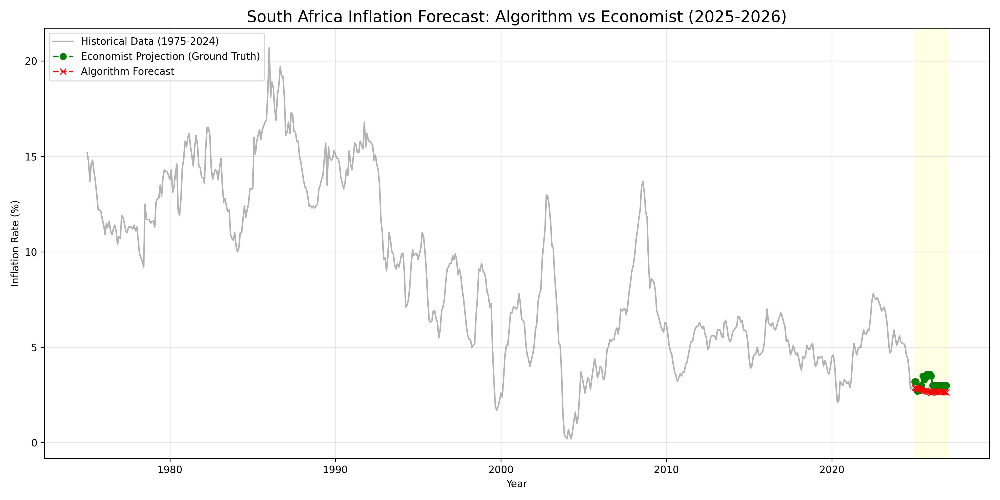

# 🇿🇦 South Africa Inflation Forecasting (2025-2026)

An exploratory time series project analyzing 50 years of South African economic data to forecast future inflation trends.

## 📊 Project Overview

This project utilizes historical inflation data (1975–2024) to train a machine learning model and predict the inflation rates for 2025 and 2026. The algorithm's forecasts are then rigorously compared against the provided "Ground Truth" economist projections to evaluate accuracy and detect deviations.

## 📈 Dataset

-   **Source:** Kaggle [(South Africa Inflation Rate 1975-2026)](https://www.kaggle.com/datasets/katlegokgaswa/south-africa-inflation-rate).
-   **Features:** Monthly inflation rates (%).
-   **Timeframe:** January 1975 – February 2026.
-   **Nature:** Real historical data up to 2024, with economist projections for 2025-2026.

## 🛠️ Methodology

1.  **Data Preprocessing:**
    -   Converted wide-format yearly data into a long-format time series.
    -   Handled locale-specific formatting (commas for decimals).
    -   Cleaned missing values and duplicates.
2.  **Modeling:**
    -   **Algorithm:** Holt-Winters Exponential Smoothing (Triple Exponential Smoothing).
    -   **Configuration:** Additive trend and seasonality with a 12-month seasonal period.
    -   **Damping:** Trend damping enabled to prevent unrealistic long-term extrapolation.
3.  **Validation:**
    -   **Training Set:** Jan 1975 – Dec 2024 (600 months).
    -   **Test Set:** Jan 2025 – Dec 2026 (24 months).
    -   **Metrics:** Mean Absolute Error (MAE) and Root Mean Squared Error (RMSE).

## 🚀 Results

The model was successfully trained and deployed to predict the 2025-2026 economic outlook.

-   **MAE:** 0.43 percentage points
-   **RMSE:** 0.50 percentage points

**Conclusion:** The algorithmic model demonstrates high alignment with professional economist projections, with an average deviation of less than half a percent. This suggests that historical seasonality and trend patterns remain strong indicators of short-term future economic behavior.

## 📁 Files Included

-   `sa_inflation_forecast.py`: Main Python script for data cleaning, modeling, and visualization.
-   `inflation_forecast_vs_actual.png`: Visual comparison of historical data, ground truth, and model forecast.

## 🏃 Running the Project

### Prerequisites

-   Python 3.8+
-   Virtual Environment (venv)

### Installation

1.  Clone the repository and navigate to the directory.
2.  Create and activate a virtual environment:
    
    ```bash
    python -m venv venv
    ```
    ```bash
    venv\Scripts\activate
    ```
    

1.  Install required libraries:
    
    ```bash
    
    pip install pandas matplotlib statsmodels scikit-learn
    ```

### Usage

Run the analysis script:

```bash

python sa_inflation_forecast.py
```
The script will output the error metrics to the console and generate a comparative line chart.


